# ER-диаграмма IMDS Marketing Platform

Документ описывает целевую логическую модель. Phase 1 реализует identity, agencies, memberships, clients, client access и application shell. Остальные сущности добавляются по фазам без изменения tenant boundary.

## Основные правила

- Все tenant-owned сущности содержат `agency_id`.
- Все client-owned сущности содержат `client_id` и проверяют принадлежность клиента агентству.
- Пользователь может состоять в нескольких агентствах через `agency_memberships`.
- Роль клиента не хранится как глобальная роль пользователя: доступ клиента задаётся через `client_users`.
- OAuth credentials не хранятся в этой БД; `data_sources` ссылаются на `credential_handle` Integration Service.
- Метрики показаны логически. В Phase 1 они могут храниться в PostgreSQL; целевой fact store — ClickHouse.

## Mermaid ER

```mermaid
erDiagram
    AUTH_USERS ||--o{ USER_PROFILES : has
    AUTH_USERS ||--o{ USER_SESSIONS : opens
    AUTH_USERS ||--o{ LOGIN_METHODS : uses
    AUTH_USERS ||--o{ AGENCY_MEMBERSHIPS : joins

    AGENCIES ||--o{ AGENCY_MEMBERSHIPS : contains
    AGENCIES ||--o{ CLIENTS : owns
    AGENCIES ||--o{ API_KEYS : issues
    AGENCIES ||--o{ TEMPLATES : owns
    AGENCIES ||--o{ ROLLUPS : owns
    AGENCIES ||--o{ BULK_OPERATIONS : runs
    AGENCIES ||--o{ EXPORTS : requests
    AGENCIES ||--o{ ACTIVITY_LOG : records

    CLIENTS ||--o{ CLIENT_USERS : grants
    AUTH_USERS ||--o{ CLIENT_USERS : receives
    CLIENTS ||--o{ DATA_SOURCES : connects
    CLIENTS ||--o{ DASHBOARDS : owns
    CLIENTS ||--o{ REPORTS : owns
    CLIENTS ||--o{ VIEWS : owns
    CLIENTS ||--o{ CUSTOM_METRICS : owns
    CLIENTS ||--o{ KPIS : owns
    CLIENTS ||--o{ FILES : owns
    CLIENTS ||--o{ ANNOTATIONS : owns

    INTEGRATIONS ||--o{ DATA_SOURCES : configures
    DATA_SOURCES ||--o{ DATA_SOURCE_ACCOUNTS : exposes
    DATA_SOURCES ||--o{ SYNC_JOBS : schedules
    DATA_SOURCES ||--o{ METRIC_FACTS : produces

    DASHBOARDS ||--o{ DASHBOARD_SECTIONS : contains
    REPORTS ||--o{ REPORT_SECTIONS : contains
    DASHBOARD_SECTIONS ||--o{ WIDGETS : contains
    REPORT_SECTIONS ||--o{ WIDGETS : contains

    REPORTS }o--|| TEMPLATES : may_use
    ROLLUPS }o--o{ CLIENTS : aggregates
    EXPORTS }o--|| AUTH_USERS : requested_by
    ACTIVITY_LOG }o--|| AUTH_USERS : actor

    AGENCIES {
      uuid id PK
      text name
      text phone
      text website
      text language
      text timezone
      text plan
      timestamptz trial_ends_at
      jsonb branding
      timestamptz created_at
    }

    AUTH_USERS {
      uuid id PK
      text email
    }

    USER_PROFILES {
      uuid user_id PK,FK
      text name
      text avatar_url
      text locale
      timestamptz created_at
    }

    AGENCY_MEMBERSHIPS {
      uuid id PK
      uuid agency_id FK
      uuid user_id FK
      text role
      jsonb permissions
      text status
      timestamptz created_at
    }

    USER_SESSIONS {
      uuid id PK
      uuid user_id FK
      text session_id
      inet ip
      text user_agent
      timestamptz last_seen_at
      timestamptz revoked_at
    }

    LOGIN_METHODS {
      uuid id PK
      uuid user_id FK
      text provider
      text external_id
      timestamptz created_at
    }

    CLIENTS {
      uuid id PK
      uuid agency_id FK
      text company
      text url
      text timezone
      text country
      text language
      text logo_url
      text brand_color
      text portal_subdomain
      text status
      date start_date
      timestamptz created_at
    }

    CLIENT_USERS {
      uuid client_id FK
      uuid user_id FK
      jsonb permissions
      timestamptz created_at
    }

    INTEGRATIONS {
      uuid id PK
      text slug UK
      text name
      text category
      text icon
      text auth_type
      boolean is_beta
      jsonb schema
    }

    DATA_SOURCES {
      uuid id PK
      uuid agency_id FK
      uuid client_id FK
      uuid integration_id FK
      text label
      text external_identifier
      text credential_handle
      text status
      timestamptz last_sync_at
      text sync_error
      jsonb settings
    }

    DATA_SOURCE_ACCOUNTS {
      uuid id PK
      uuid data_source_id FK
      text external_account_id
      text account_name
      text currency
      text timezone
      boolean selected
      jsonb metadata
    }

    SYNC_JOBS {
      uuid id PK
      uuid agency_id FK
      uuid data_source_id FK
      date period_from
      date period_to
      text state
      int attempts
      timestamptz run_after
      jsonb payload
      text last_error
    }

    DASHBOARDS {
      uuid id PK
      uuid agency_id FK
      uuid client_id FK
      text name
      boolean is_smart
      jsonb layout
      int position
      timestamptz created_at
    }

    DASHBOARD_SECTIONS {
      uuid id PK
      uuid agency_id FK
      uuid dashboard_id FK
      uuid data_source_id FK
      text title
      int position
      jsonb settings
    }

    REPORTS {
      uuid id PK
      uuid agency_id FK
      uuid client_id FK
      uuid template_id FK
      text name
      jsonb schedule
      jsonb recipients
      timestamptz last_sent_at
      text status
    }

    REPORT_SECTIONS {
      uuid id PK
      uuid agency_id FK
      uuid report_id FK
      uuid data_source_id FK
      text title
      int position
      jsonb settings
    }

    WIDGETS {
      uuid id PK
      uuid agency_id FK
      uuid dashboard_section_id FK
      uuid report_section_id FK
      text type
      text integration_slug
      text metric_key
      text dimension_key
      jsonb date_range
      jsonb filters
      jsonb settings
      int x
      int y
      int w
      int h
      text color
      text title
    }

    VIEWS {
      uuid id PK
      uuid agency_id FK
      uuid client_id FK
      text name
      jsonb definition
      timestamptz created_at
    }

    CUSTOM_METRICS {
      uuid id PK
      uuid agency_id FK
      uuid client_id FK
      text name
      text formula
      text format
      jsonb dependencies
    }

    KPIS {
      uuid id PK
      uuid agency_id FK
      uuid client_id FK
      text metric_key
      numeric target_value
      text comparison
      jsonb alert_rules
      text status
    }

    ROLLUPS {
      uuid id PK
      uuid agency_id FK
      text name
      jsonb layout
      timestamptz created_at
    }

    TEMPLATES {
      uuid id PK
      uuid agency_id FK
      text kind
      text name
      jsonb payload
      timestamptz created_at
    }

    BULK_OPERATIONS {
      uuid id PK
      uuid agency_id FK
      text action
      jsonb target_ids
      text state
      numeric progress
      jsonb result
      timestamptz created_at
    }

    EXPORTS {
      uuid id PK
      uuid agency_id FK
      uuid requested_by FK
      text kind
      text entity_type
      uuid entity_id
      text file_url
      text state
      timestamptz created_at
    }

    FILES {
      uuid id PK
      uuid agency_id FK
      uuid client_id FK
      text name
      text mime
      bigint size
      text storage_key
      timestamptz created_at
    }

    ANNOTATIONS {
      uuid id PK
      uuid agency_id FK
      uuid client_id FK
      date annotation_date
      text text
      text metric_key
    }

    API_KEYS {
      uuid id PK
      uuid agency_id FK
      text key_hash
      text label
      text_array scopes
      timestamptz last_used_at
      timestamptz revoked_at
    }

    ACTIVITY_LOG {
      bigint id PK
      uuid agency_id FK
      uuid client_id FK
      uuid user_id FK
      text action
      jsonb metadata
      timestamptz created_at
    }

    METRIC_FACTS {
      uuid agency_id
      uuid client_id
      uuid data_source_id
      text integration
      text entity_type
      text entity_id
      text entity_name
      date metric_date
      text metric_key
      decimal value
      map dimensions
    }
```



## Phase 1 physical schema

Phase 1 должна создать только следующий обязательный минимум:

```text
agencies
user_profiles
agency_memberships
clients
client_users
activity_log
```

И bootstrap view/function для frontend:

```text
workspace_bootstrap
├── current_user
├── agencies[]
├── active_agency
├── permissions[]
├── clients_summary
└── branding
```

## Ключевые ограничения

1. `agency_memberships` имеет unique `(agency_id, user_id)`.
2. `clients` имеет unique `(agency_id, portal_subdomain)` там, где subdomain не null.
3. `client_users` имеет primary key `(client_id, user_id)`.
4. Любая client-owned строка проверяет, что `client.agency_id = row.agency_id`.
5. Widget принадлежит либо dashboard section, либо report section, но не обоим одновременно.
6. `data_sources.credential_handle` не содержит token или secret.
7. Soft-delete или status применяется к клиентам и data sources; исторические facts не удаляются автоматически.
8. API keys и share tokens никогда не хранятся в открытом виде.

## RLS-модель Phase 1

```text
Agency Admin
  └── полный доступ к строкам своего agency_id

Agency Staff
  └── доступ определяется permissions и client assignments

Client User
  └── только clients из client_users и разрешённые portal resources
```

RLS использует membership lookup по `auth.uid()`. Проверки изменения ролей, приглашений и billing выполняются дополнительно в server-side service layer.
